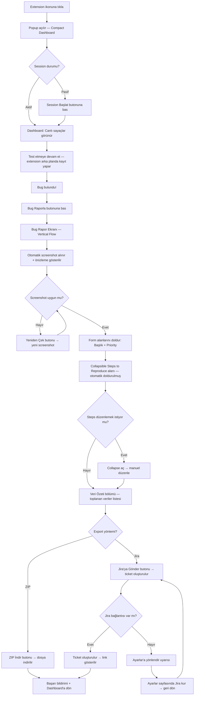
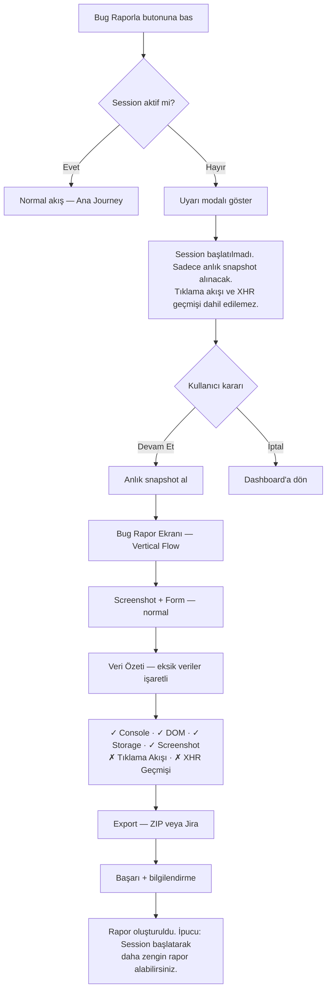
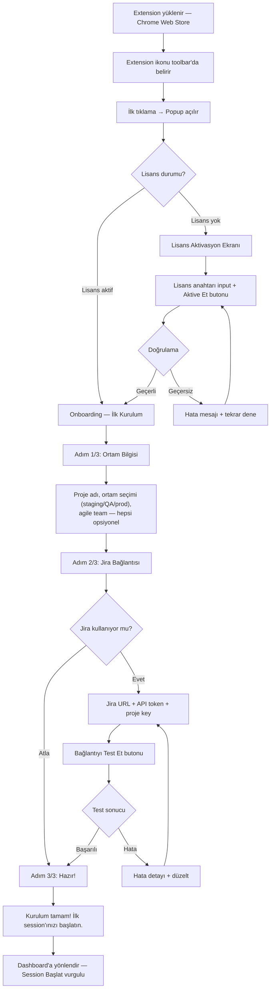

# UX Design Specification qa-helper-plugin

**Author:** Berk
**Date:** 2026-03-08

---

## Executive Summary

### Project Vision

qa-helper-plugin, manuel test süreçlerinde bug raporlama ve veri toplama problemini çözen, privacy-first bir Chrome Extension'dır. Extension, tester'ın test akışını arka planda sessizce kaydeder — tıklama akışı, XHR/Fetch istekleri, console logları, SPA route değişimleri — ve bug anında tek tıkla ekran görüntüsü, DOM snapshot, localStorage, sessionStorage, console logları ve network verilerini toplar. Toplanan veriler ZIP olarak indirilebilir veya Jira'ya doğrudan gönderilebilir.

Ürün felsefesi "sessiz kayıt cihazı" — tester'ın akışını kesmez, arka planda çalışır, bug anında tek tıkla her şeyi hazırlar. Privacy-first yaklaşımıyla tüm veriler lokalde kalır, hiçbir 3. parti sunucuya gitmez. İki Kanal Mimarisi (havacılık kara kutusundan ilham) ile kullanıcı hikayesi ve sistem hikayesi paralel kaydedilip birleşik timeline olarak sunulur.

### Target Users

| Kullanıcı           | Rol                          | Teknik Seviye | Ana İhtiyaç                                                                    |
| ------------------- | ---------------------------- | ------------- | ------------------------------------------------------------------------------ |
| **Elif** (Birincil) | Manuel Tester / QA Mühendisi | Orta          | Bug bulduğunda minimum eforla, tam teknik veri içeren rapor oluşturmak         |
| **Ahmet** (İkincil) | Frontend Developer           | İleri         | Bug raporu aldığında "reproduce edemiyorum" demeden direkt fix'e başlayabilmek |
| **Berk** (Üçüncül)  | Satın Alan / QA Lideri       | Orta          | Kolay kurulum, hızlı değer görme, takıma önerme                                |

Kullanıcılar orta-ileri seviye teknik bilgiye sahip, ancak araçtan beklentileri sıfır öğrenme eğrisi. Chrome tarayıcıda çalışıyorlar. Bireysel araç — takım yönetimi ve dashboard scope dışı.

### Key Design Challenges

1. **"Görünmezlik" Paradoksu** — Extension arka planda sessiz çalışmalı ama tester'a "evet, kayıt yapıyorum" güvenini de vermeli. Icon badge dışında sayfa içi indicator yok kararı alınmış — badge state'leri (gri/yeşil/kırmızı) çok net ve öğrenilmesi kolay olmalı.

2. **Minimal Form vs. Zengin Veri** — Tester'dan sadece 3 alan isteniyor ama arka planda 8+ veri kaynağı toplanıyor. Bu "sihri" kullanıcının anlaması ve güvenmesi lazım — otomatik toplanan şeylerin ne olduğu net gösterilmeli, ama tester'ı bunaltmamalı.

3. **İki Export Yolu** — ZIP ve Jira aynı anda mevcut. Kullanıcıyı karar yorgunluğuna sokmadan doğru yola yönlendirme (Jira kuruluysa öner, değilse ZIP ön planda).

4. **Session Yönetimi Karmaşıklığı** — Başlat/durdur, session'sız bug, crash kurtarma, çoklu tab, cross-app... Tester'ın bunların hiçbirini düşünmemesi gereken bir UX gerekli.

### Design Opportunities

1. **"Zero Config Start" Deneyimi** — Yükle → session başlat → test et → bug raporla akışı, rakiplerin hiçbirinde bu kadar basit değil. UX burada gerçek rekabet avantajı yaratabilir.

2. **Developer Perspektifli Çıktı Tasarımı** — Bug raporu sadece tester için değil, developer için de tasarlanmalı. ZIP içindeki dosya yapısı, timeline formatı, Jira description kartı — developer'ın 5 dakikada fix'e başlayacağı şekilde düzenlenmeli.

3. **Icon Badge Dili** — 3 state'lik basit bir görsel dil ile extension'ın tüm durumunu anlatan, öğrenilmesi saniyeler süren bir iletişim sistemi.

4. **Güven Mimarisi** — Privacy-first yaklaşım + "hiçbir veri dışarı çıkmaz" mesajı, UX'in her katmanına yerleştirilebilir — rakiplerden en büyük ayrışma noktası.

## Core User Experience

### Defining Experience

**Temel Aksiyon: Bug Raporlama**
Ürünün varoluş sebebi "Bug Raporla" butonu. Session başlatma bir hazırlık adımı, ama tester'ın günlük döngüsünde en çok tekrarlanan ve en kritik an **bug raporlama**. Popup'ta buton hiyerarşisi buna göre şekillenecek — "Bug Raporla" birincil, "Session Başlat/Durdur" ikincil.

**Bug Raporlama Anı Akışı:**

1. Tester "Bug Raporla"ya basar
2. **Tek ekranda** iki alan açılır:
   - **Sol/Üst:** Minimal form (beklenen sonuç, neden bug, priority)
   - **Sağ/Alt:** Toplanan veri özeti — "5 XHR isteği kaydedildi, 2 console error, 1 screenshot, DOM snapshot alındı, localStorage/sessionStorage dump edildi" gibi bir checklist/özet kartı
3. Tester formu doldurur, aşağıda **ZIP İndir** ve **Jira'ya Gönder** butonları yan yana görünür
4. Jira kurulu değilse Jira butonu disabled + "Ayarlardan kur" linki

### Platform Strategy

- **Platform:** Chrome Extension (Manifest V3) — sadece Chrome
- **Etkileşim:** Mouse/keyboard — touch desteği gerekli değil
- **Offline:** Tam offline çalışma (lisans doğrulama ve Jira gönderimi hariç tüm özellikler)
- **UI Framework:** Popup ve Options Page için Preact (3KB, React API uyumlu), content scripts vanilla JS
- **Extension Bileşenleri:**
  - **Popup:** Session yönetimi + bug raporlama + konfigürasyon görünürlüğü — tek sayfada
  - **Options Page:** Detaylı ayarlar (Jira kurulumu, lisans, toggle'lar)
  - **Content Scripts:** Veri toplama (performans kritik)
  - **Service Worker:** Session persist, background logic

### Effortless Interactions

| Etkileşim            | Effortless Tasarım                                                                                                                                   |
| -------------------- | ---------------------------------------------------------------------------------------------------------------------------------------------------- |
| **Session Başlatma** | Popup'ta büyük toggle — tek tıkla. Yanında aktif konfigürasyonlar görünür (environment, proje vb.) — tester değiştirmek isterse hemen değiştirebilir |
| **Bug Raporlama**    | Tek tıkla form + veri özeti açılır. Tüm teknik veri arka planda otomatik toplanmış — tester sadece 3 alan doldurur                                   |
| **Export**           | ZIP ve Jira yan yana — karar yorgunluğu yok, ikisi de tek tıkla. Jira kurulu değilse soft disable                                                    |
| **Session'sız Bug**  | Uyarı ver ama engelleme — anlık snapshot al, tester akışı kırılmasın                                                                                 |
| **Crash Kurtarma**   | Otomatik — tester hiçbir şey yapmasın, session geri gelsin                                                                                           |
| **Konfigürasyon**    | Popup'ta görünür ve değiştirilebilir — options page'e gitmeye gerek kalmasın (temel ayarlar için)                                                    |

### Critical Success Moments

1. **"Gerçekten bu kadar kolay mı?" Anı** — İlk bug raporlamada tester'ın formu doldurup tek tıkla ZIP/Jira export yapması < 30 saniye. Bu an ürünün satıldığı an.

2. **"Vay, hepsini toplamış!" Anı** — Bug raporlama ekranında toplanan veri özetini gördüğünde — "5 XHR, 3 console error, DOM, storage" — tester'ın gözleri parlıyor. Arka plandaki sihri ilk kez görüyor.

3. **Developer'ın "Harika rapor" Anı** — Ahmet ticket'ı açtığında yapılandırılmış dosyalar, okunabilir timeline, net steps to reproduce görüyor. "Reproduce edemiyorum" tarihe karışıyor.

4. **"Hiçbir şey kaybetmedim" Anı** — Tab crash sonrası session otomatik kurtarılıyor. Tester veri kaybı yaşamıyor.

5. **Popup Açılış Anı** — Popup açıldığında tester anında durumu kavrar: session aktif mi, hangi konfigürasyonla çalışıyor, kaç XHR/error kaydedilmiş. Bilişsel yük sıfır.

### Experience Principles

| Prensip                     | Açıklama                                                                                                                                          |
| --------------------------- | ------------------------------------------------------------------------------------------------------------------------------------------------- |
| **1. Sessiz Güç**           | Extension görünmez ama güçlü — arka planda her şeyi kaydeder, tester sadece "Bug Raporla"ya basar                                                 |
| **2. Tek Ekran Yeter**      | Her kritik aksiyon tek ekranda tamamlanır — popup'tan çıkmaya gerek yok (temel işlemler için)                                                     |
| **3. Göster, Sorma**        | Toplanan verileri göster (özet), neyi topladığını sorma. Toggle'lar "isterseniz kapatın" için, "isterseniz açın" için değil — varsayılan hep açık |
| **4. İki Yol, Sıfır Karar** | ZIP ve Jira her zaman mevcut — tester hangisini istiyorsa onu seçer, varsayılan yok, baskı yok                                                    |
| **5. Kırılmaz**             | Crash, session'sız bug, network kesintisi — hiçbir senaryo tester'ı çıkmaza sokmaz, her zaman bir yol var                                         |

## Desired Emotional Response

### Primary Emotional Goals

| Birincil Duygu               | Açıklama                                                                                                                      | Hedef Kullanıcı   |
| ---------------------------- | ----------------------------------------------------------------------------------------------------------------------------- | ----------------- |
| **Güçlenmiş / Desteklenmiş** | "Bu araç benim asistanım, her şeyi hallediyor" — tester kendini yalnız hissetmiyor, araç onun arkasında                       | Elif (Tester)     |
| **Rahatlama**                | "Sonunda düzgün bir rapor!" — developer ilk kez tam bağlamlı bir bug raporu alıyor, rahat bir nefes                           | Ahmet (Developer) |
| **Privacy Huzuru**           | "Verilerim güvende, teknik olarak derin, ve buna rağmen basit" — rakiplerden geçen kullanıcı üç katmanlı ayrışmayı hissediyor | Yeni Kullanıcı    |

### Emotional Journey Mapping

| Aşama                                | Tester Hissiyatı                                            | Tasarım Yanıtı                                                                       |
| ------------------------------------ | ----------------------------------------------------------- | ------------------------------------------------------------------------------------ |
| **İlk Keşif** (Chrome Web Store)     | Merak + "privacy-first" güveni                              | Store açıklamasında "verileriniz asla dışarı çıkmaz" vurgusu                         |
| **Kurulum & İlk Açılış**             | "Bu kadar mı? Hemen başlayabilirim?" — şaşkınlık + güven    | Zero config start, popup'ta net durum göstergesi                                     |
| **Session Başlatma**                 | "Tamam, arka planda hallediyor" — güvenle test etmeye devam | Yeşil badge + popup'ta session bilgisi, akış bozulmuyor                              |
| **Bug Bulma Anı**                    | Heyecan + "hemen raporlayayım" dürtüsü                      | "Bug Raporla" butonu her zaman erişilebilir, kırmızı badge zaten uyarıyor            |
| **Bug Raporlama**                    | "Vay, hepsini toplamış!" — güçlenmiş hissetme               | Veri özeti kartı: kaç XHR, kaç error, DOM, storage — "asistanım her şeyi hazırlamış" |
| **Export**                           | "Bu kadar basit miydi?" — tatmin + verimlilik               | ZIP ve Jira yan yana, tek tıkla tamamlanıyor                                         |
| **Hata Durumu** (session'sız, crash) | "En azından elimde bir şey var" — pragmatik teselli         | Uyarı + mevcut veriyle devam. Suçlamayan, çözüm sunan ton                            |
| **Tekrar Kullanım**                  | "Bu araçsız test etmem artık" — bağımlılık + güven          | Tutarlı deneyim, her seferinde aynı güvenilirlik                                     |

### Micro-Emotions

| Mikro-Duygu                    | Bağlam                        | Tasarım Yansıması                                                                                        |
| ------------------------------ | ----------------------------- | -------------------------------------------------------------------------------------------------------- |
| **Güven vs. Şüphe**            | "Gerçekten kayıt yapıyor mu?" | Yeşil badge + popup'ta canlı sayaçlar (XHR sayısı, error sayısı) — sessiz ama kanıtlı                    |
| **Kontrol vs. Belirsizlik**    | "Neyi topluyor bilmiyorum"    | Veri özeti kartı her zaman görünür, toggle'larla kontrol — tester patron                                 |
| **Rahatlık vs. Endişe**        | "Verilerim nereye gidiyor?"   | Privacy-first mesajı her katmanda: popup footer, options page, export anı — "tüm veriler cihazınızda"    |
| **Tatmin vs. Hayal Kırıklığı** | Export sonrası                | Başarı durumu net: "✓ ZIP indirildi (2.3 MB)" / "✓ Jira ticket oluşturuldu — PROJ-123" — somut sonuç     |
| **Pragmatizm vs. Panik**       | Hata durumları                | Session'sız bug: "Session kaydı yok, ama anlık snapshot alınacak. Devam?" — cezalandırmayan, çözüm sunan |

### Design Implications

| Duygusal Hedef             | UX Tasarım Kararı                                                                                                                           |
| -------------------------- | ------------------------------------------------------------------------------------------------------------------------------------------- |
| **"Asistanım hallediyor"** | Veri toplama tamamen otomatik, popup'ta "X veri toplandı" özet kartı, tester hiçbir teknik aksiyon almıyor                                  |
| **Rahatlama (Developer)**  | Yapılandırılmış çıktı: ayrı dosyalar (xhr-log.json, console-logs.json, dom-snapshot.html), okunabilir timeline, otomatik steps to reproduce |
| **Pragmatik Teselli**      | Hata mesajları suçlayıcı değil, çözüm odaklı: "Session yok → snapshot alınacak", "Jira bağlanamadı → ZIP indir"                             |
| **Privacy Huzuru**         | Popup footer: "🔒 Tüm veriler cihazınızda" — her zaman görünür. Options page'de detaylı privacy açıklaması                                  |
| **Üç Katmanlı Ayrışma**    | Onboarding/ilk kullanımda rakip karşılaştırma hissi: derinlik (veri özeti), basitlik (tek tıkla export), güvenlik (lokal veri)              |

### Emotional Design Principles

| Prensip                      | Uygulama                                                                                                                              |
| ---------------------------- | ------------------------------------------------------------------------------------------------------------------------------------- |
| **1. Asistan, Araç Değil**   | Extension bir "tool" gibi değil, bir "yardımcı" gibi hissettirmeli. Dili: "Topladım", "Hazırladım", "Kaydettim" — birinci tekil şahıs |
| **2. Cezalandırma Yok**      | Session unutulmuş? Crash olmuş? Network yok? Hiçbir durumda suçlama yok — "elimden gelenin en iyisini yapıyorum" tonu                 |
| **3. Kanıtla Güven**         | "Kayıt yapıyorum" demek yetmez — canlı sayaçlar, veri özeti, badge rengi ile kanıtla. Güven sözle değil, göstererek inşa edilir       |
| **4. Somut Sonuç**           | Her aksiyonun somut bir çıktısı var: "✓ ZIP indirildi (2.3 MB)", "✓ PROJ-123 oluşturuldu". Soyut başarı mesajı yok                    |
| **5. Her Zaman Bir Yol Var** | Jira bağlanamıyor → ZIP. Session yok → Snapshot. Crash → Kurtarma. Kullanıcı asla çıkmaza girmiyor                                    |

## UX Pattern Analysis & Inspiration

### Inspiring Products Analysis

#### 1. Sentry (Error Monitoring)

**Ne yapıyor iyi:** Breadcrumbs konsepti — bir hata oluşmadan önceki tüm adımları (HTTP istekleri, console logları, kullanıcı aksiyonları) zaman damgalı bir timeline'da gösteriyor. Developer hata bağlamını anında kavrar.

**UX Dersleri:**

- **Breadcrumbs timeline** — İki Kanal Mimarisi timeline'ımız için direkt ilham. Kullanıcı aksiyonları + sistem olayları paralel zaman çizgisinde
- **Error grouping** — console error'ları sadece listelemek yerine, bağlamla zenginleştirme (hangi sayfa, hangi aksiyon sonrası)
- **Compact bilgi yoğunluğu** — çok veriyi az alanda gösterme becerisi, dashboard'da bilgi hiyerarşisi

#### 2. VS Code (IDE)

**Ne yapıyor iyi:** Status bar ile minimal ama sürekli durum bilgisi. Extension marketplace'te bir extension yüklediğinde "just works" — konfigürasyon minimal, varsayılanlar akıllı.

**UX Dersleri:**

- **Status bar paradigması** — icon badge sistemimiz için ilham: küçük alan, büyük bilgi. Gri/yeşil/kırmızı badge = VS Code'un status bar ikonları
- **Command Palette** — tek bir erişim noktasından her şeye ulaşma. Popup bu rolü oynuyor
- **Akıllı varsayılanlar** — toggle'lar varsayılan açık, tester isterse kapatır (VS Code ayarlar mantığı)

#### 3. Chrome DevTools (Developer Tool)

**Ne yapıyor iyi:** Network tab, Console, Elements — her şey tab bazlı organize, filtrele, ara. Karmaşık veriyi erişilebilir kılan bilgi mimarisi.

**UX Dersleri:**

- **Kategorize çıktı** — XHR logları, console logları, DOM ayrı dosyalar olarak export edilmesi DevTools'un tab yapısından ilham
- **Filter & search** — bug raporlama özetinde veri kategorilerini net ayırma
- **Performans farkındalığı** — DevTools'un "açıkken bile sayfayı yavaşlatmaması" ilkesi, extension'ın "hiç fark ettirmemesi" ile paralel

#### 4. Jam.dev (Rakip — Chrome Extension)

**Ne yapıyor iyi:** Tek tıkla bug raporu vaadi, screenshot + console + network toplama. Chrome extension popup UX'i basit.

**UX Dersleri (ne alınacak):**

- Popup'ta minimal buton sayısı — "Report Bug" ana aksiyon
- Screenshot anında alınıp gösterilmesi — görsel geri bildirim

**UX Dersleri (neden daha iyi olacağız):**

- Jam.dev SaaS — veri sunucuya gidiyor. Biz lokal
- Jam.dev annotation odaklı — biz teknik derinlik (DOM, storage, XHR tam akış)
- Jam.dev session kaydı video bazlı — biz daha hafif (timeline + data)

### Transferable UX Patterns

#### Navigasyon & Bilgi Mimarisi

| Pattern                       | Kaynak                  | qa-helper-plugin Uygulaması                                                                                           |
| ----------------------------- | ----------------------- | --------------------------------------------------------------------------------------------------------------------- |
| **Status Bar / Badge Durumu** | VS Code                 | Icon badge 3 state: gri (pasif), yeşil (session aktif), kırmızı rakam (console error sayısı)                          |
| **Breadcrumbs Timeline**      | Sentry                  | İki Kanal timeline: kullanıcı aksiyonları (tıklama, navigasyon) + sistem olayları (XHR, console) paralel              |
| **Kategorize Çıktı**          | DevTools                | Export dosyaları: xhr-log.json, console-logs.json, dom-snapshot.html, timeline.json — her biri bağımsız tüketilebilir |
| **Single Entry Point**        | VS Code Command Palette | Popup = tek erişim noktası. Session başlat, bug raporla, ayarları gör — hepsi burada                                  |

#### Etkileşim Patternleri

| Pattern                    | Kaynak            | qa-helper-plugin Uygulaması                                                                                  |
| -------------------------- | ----------------- | ------------------------------------------------------------------------------------------------------------ |
| **Progressive Disclosure** | Gmail, Notion     | Popup'ta özet → Bug raporlama ekranında detay → Options page'de tam konfigürasyon                            |
| **Inline Editing**         | Notion, Linear    | Popup'ta konfigürasyon alanları (environment, proje) hemen değiştirilebilir — ayrı sayfaya gitmeye gerek yok |
| **Graceful Degradation**   | Spotify (offline) | Jira yok → ZIP. Session yok → Snapshot. Crash → Kurtarma. Her seviyede fallback                              |
| **Smart Defaults**         | VS Code           | Tüm toggle'lar varsayılan açık, environment bir kez ayarlanır, her rapora otomatik eklenir                   |

#### Görsel & Duygusal Patternler

| Pattern                  | Kaynak           | qa-helper-plugin Uygulaması                                                      |
| ------------------------ | ---------------- | -------------------------------------------------------------------------------- |
| **Canlı Sayaçlar**       | Sentry Dashboard | Popup'ta: "12 XHR · 3 Error · 5 Sayfa" — session'ın canlı olduğunu kanıtlar      |
| **Başarı Konfirmasyonu** | Stripe Checkout  | "✓ ZIP indirildi (2.3 MB)" / "✓ PROJ-123 oluşturuldu" — somut, spesifik          |
| **Trust Indicators**     | Banking Apps     | Popup footer: "🔒 Tüm veriler cihazınızda" — her zaman görünür privacy güvencesi |
| **Birinci Şahıs Dil**    | Slack Bot        | "3 XHR isteği kaydettim", "Screenshot'ı aldım" — araç değil asistan hissi        |

### Anti-Patterns to Avoid

| Anti-Pattern                 | Nerede Görülür          | Neden Kaçınılacak                                                                                            |
| ---------------------------- | ----------------------- | ------------------------------------------------------------------------------------------------------------ |
| **Aşırı Onboarding**         | Birçok SaaS aracı       | Tester "yükle → başla" istiyor. 5 adımlık tour, tooltip sağanağı = terk. Zero config start bozulur           |
| **Modal Cehennem**           | Eski Jira UI            | Pop-up içinde pop-up, konfirmasyon üstüne konfirmasyon. Tek ekran yeter prensibini bozar                     |
| **Varsayılan Kapalı Toggle** | Bazı privacy araçları   | "İsterseniz açın" yerine "isterseniz kapatın" — değer varsayılan olarak sunulmalı                            |
| **Belirsiz Durum**           | Birçok extension        | Badge/ikon hiçbir şey söylemiyor — "çalışıyor mu çalışmıyor mu?" şüphesi. Kanıtla Güven prensibini bozar     |
| **Suçlayıcı Hata Mesajları** | Genel                   | "Hata: Session başlatılmadı!" yerine "Session kaydı yok, anlık snapshot alınacak. Devam?" — cezalandırma yok |
| **Veri Çöplüğü Çıktısı**     | Ham log export araçları | Yapılandırılmamış, parse edilmesi zor çıktı. Developer'ı bunaltır. Kategorize + okunabilir çıktı şart        |
| **Zorunlu Entegrasyon**      | BugHerd, Marker.io      | "Önce X'i bağlayın" — biz Jira olmadan tam fonksiyonel. ZIP her zaman çalışır                                |

### Design Inspiration Strategy

**Adopt (Olduğu Gibi Al):**

- Sentry breadcrumbs → İki Kanal timeline formatı
- VS Code icon status → Badge 3-state sistemi
- DevTools kategorize veri → Export dosya yapısı
- Stripe başarı mesajları → Somut export konfirmasyonu

**Adapt (Uyarlayarak Al):**

- VS Code Command Palette → Chrome Extension popup'a uyarla (daha az komut, daha çok görsel durum)
- Sentry dashboard sayaçları → Popup boyutuna sığan kompakt sayaçlar (XHR · Error · Sayfa)
- Notion inline editing → Popup'ta konfigürasyon inline değiştirme (dropdown, toggle)
- Gmail progressive disclosure → Popup özet → Bug form detay → Options page tam ayar

**Avoid (Kesinlikle Yapma):**

- SaaS onboarding sağanağı — zero config start'ı koru
- Modal/konfirmasyon zinciri — tek ekranda tamamla
- Suçlayıcı hata tonlaması — pragmatik teselli tonu koru
- Zorunlu entegrasyon kısıtlaması — Jira olmadan tam fonksiyonel kal

## Design System Foundation

### Design System Choice

**Seçim: Tailwind CSS + Custom Preact Component Set**

Chrome Extension bağlamında Tailwind CSS, utility-first yaklaşımı ile en uygun design system temeli. Preact componentleri Tailwind class'ları ile stillendirilecek, hazır bir component library kullanılmayacak.

### Rationale for Selection

| Karar Faktörü        | Tailwind CSS Uygunluğu                                                                                                      |
| -------------------- | --------------------------------------------------------------------------------------------------------------------------- |
| **Bundle Boyutu**    | JIT derlemesi ile sadece kullanılan class'lar dahil edilir — extension .crx boyutuna minimal etki (tipik olarak 5-10KB CSS) |
| **Preact Uyumu**     | Framework agnostik — Preact JSX'te className ile doğrudan kullanılır, ek adaptör veya plugin gerekmez                       |
| **Tek Geliştirici**  | Utility class'lar ile hızlı prototipleme, ayrı CSS dosyaları yönetme yükü yok                                               |
| **Popup Kısıtları**  | Responsive utility'ler ile 400x600px popup alanında hassas yerleşim kontrolü                                                |
| **Özelleştirme**     | tailwind.config.js ile ürüne özel renk paleti, spacing, border-radius, font tanımları                                       |
| **Extension Ortamı** | CSS-in-JS runtime overhead yok, shadow DOM ile uyumlu, CSP sorunları yok                                                    |
| **Bakım**            | Tek dosyada config, tutarlı design token'lar, ekip büyüse bile stil tutarlılığı korunur                                     |

### Implementation Approach

**Build Pipeline:**

- Vite + Preact + Tailwind CSS (PostCSS plugin)
- JIT mode ile production build'de sadece kullanılan class'lar
- Popup ve Options Page ayrı entry point, ortak Tailwind config

**Dosya Yapısı:**

```
src/
├── popup/           # Popup UI (Preact + Tailwind)
├── options/         # Options Page UI (Preact + Tailwind)
├── components/      # Paylaşılan Preact componentleri
│   ├── Button.jsx
│   ├── Badge.jsx
│   ├── Toggle.jsx
│   ├── Card.jsx
│   └── ...
├── styles/
│   └── tailwind.css # @tailwind base/components/utilities
└── tailwind.config.js
```

**Component Stratejisi:**
Küçük, yeniden kullanılabilir Preact componentleri Tailwind class'ları ile:

- **Button** — Primary (bug raporla), Secondary (session toggle), Ghost (ayarlar)
- **Badge** — Session durum göstergesi, sayaç badge'leri
- **Toggle** — Veri kaynağı toggle'ları (HAR, Console, DOM, storage)
- **Card** — Veri özeti kartı, konfigürasyon kartı
- **Alert** — Uyarı mesajları (session'sız bug, Jira bağlantı hatası)
- **Input/Select** — Form alanları (bug form, konfigürasyon)

### Customization Strategy

**Design Token'lar (tailwind.config.js):**

```js
// Renk Paleti — QA/Testing aracı için güven + profesyonellik
colors: {
  primary: { ... },     // Mavi tonları — güven, profesyonellik
  success: { ... },     // Yeşil — session aktif, başarılı export
  danger: { ... },      // Kırmızı — console error, kritik uyarı
  warning: { ... },     // Turuncu — session'sız bug uyarısı
  neutral: { ... },     // Gri tonları — pasif durum, ikincil bilgi
}

// Extension-specific spacing
spacing: {
  'popup-padding': '12px',
  'card-gap': '8px',
}

// Kompakt font boyutları (popup için)
fontSize: {
  'xs': '11px',
  'sm': '12px',
  'base': '13px',
  'lg': '14px',
}
```

**Tasarım Kararları:**

- **Popup'ta kompakt spacing** — her piksel değerli, padding/margin minimal ama okunabilir
- **Options page'de standart spacing** — tam sayfa, normal web deneyimi
- **Karanlık/Açık tema:** İlk fazda sadece açık tema, karanlık tema Faz 2'de değerlendirilir
- **İkon seti:** Lucide Icons (tree-shakeable, 1KB/ikon) veya inline SVG
- **Font:** Sistem fontu (system-ui) — ek font yükleme yok, extension boyutuna sıfır etki

## Core User Experience

### Defining Experience

**"Test et, bug bul, tek tıkla her şeyi topla"**

qa-helper-plugin'in tanımlayıcı deneyimi şudur: Tester bug buluyor → "Bug Raporla"ya basıyor → **screenshot otomatik alınıyor, tüm teknik veriler arka plandan derleniyor, minimal form açılıyor** → 30 saniye içinde ZIP veya Jira ile paylaşılıyor. Tester'ın arkadaşına anlatacağı cümle: "Butona bastım, her şeyi topladı."

Bu deneyimi benzersiz kılan şey, tester'ın hiçbir teknik aksiyon almaması — extension asistan gibi arka planda çalışıp, bug anında her şeyi hazır sunması.

### User Mental Model

**Şu anki çözüm (acı noktası):**

1. Bug bul → DevTools aç → Console'u kopyala → Network tab'a geç → İlgili istekleri bul → localStorage'ı kontrol et → Screenshot al → Hepsini Jira'ya yapıştır → 10-15 dakika

**Yeni mental model:**

1. Bug bul → "Bug Raporla"ya bas → Form doldur (3 alan) → Export → 30 saniye

**Kullanıcı beklentisi:**

- "Butona basıyorum, gerisini o hallediyor" — asistan metaforu
- Tester DevTools'u bilir ama açmak istemez. Extension onun yerine açıp topluyor
- "Ne topladığını görmek istiyorum ama müdahale etmek zorunda değilim"

**Olası kafa karışıklığı noktaları:**

- "Session başlatmadım, ne olacak?" → Uyarı + snapshot ile çözülüyor
- "Screenshot'ı beğenmedim" → Tekrar alma seçeneği var
- "Steps to reproduce doğru mu?" → Collapsible açıp bakabilir

### Success Criteria

| Kriter                          | Ölçüm                                                          |
| ------------------------------- | -------------------------------------------------------------- |
| Bug raporlama süresi            | < 30 saniye (form dahil)                                       |
| Tester'ın teknik aksiyon sayısı | 0 (DevTools açma, console kopyalama yok)                       |
| "Bu kadar kolay mı?" anı        | İlk bug raporlamada yaşanmalı                                  |
| Screenshot memnuniyeti          | Otomatik alınan yeterli olmalı (çoğu durumda tekrar gerek yok) |
| Developer geri bildirim döngüsü | "Reproduce edemiyorum" oranı → %0                              |
| Veri bütünlüğü                  | Her raporda en az: screenshot + DOM + console + XHR + storage  |

### Novel UX Patterns

| Kalıp                                 | Tür                   | Açıklama                                                                                                                                                  |
| ------------------------------------- | --------------------- | --------------------------------------------------------------------------------------------------------------------------------------------------------- |
| **Otomatik Screenshot + Tekrar Alma** | Yenilikçi Adaptasyon  | Rakipler ya tamamen otomatik ya da tamamen manuel. Biz ikisini birleştiriyoruz: otomatik al, beğenmezsen değiştir. En iyi varsayılan + kullanıcı kontrolü |
| **Collapsible Steps to Reproduce**    | Yenilikçi             | Otomatik oluşturulan steps gizli/collapsible — tester güveniyorsa açmaz, merak ederse açar. "Göster, Sorma" prensibinin uygulaması                        |
| **Dikey Scroll Bug Formu**            | Kanıtlanmış           | Yukarıda form → aşağıda veri özeti → en altta export. Mobil form patternlerinden bilinen, popup boyutunda kanıtlanmış akış                                |
| **Canlı Veri Özeti Kartı**            | Sentry'den Adaptasyon | Export öncesi "5 XHR · 2 Error · DOM ✓ · Storage ✓" — Sentry dashboard'undan ilham, popup boyutuna uyarlanmış                                             |
| **Çift Export Butonu**                | Kanıtlanmış           | ZIP ve Jira yan yana — e-ticaret "sepet" patterninden ilham (ödeme yöntemleri yan yana)                                                                   |

**Eğitim gerektirmeyen tasarım:**
Tüm patternler kullanıcıların zaten bildiği kalıplardan oluşuyor — form doldur, butona bas, indir. İnovasyon "neyin toplandığında" ve "ne kadar hızlı olduğunda", etkileşim kalıbında değil.

### Experience Mechanics

#### 1. Initiation — "Bug Raporla" Tetikleme

```
Tester popup'ı açar → "Bug Raporla" butonuna basar
                       ↓
          [Anında] Screenshot otomatik alınır
          [Anında] DOM snapshot alınır
          [Anında] localStorage/sessionStorage dump edilir
          [Anında] Console logları derlenir
          [Anında] Session kayıt verileri (XHR, tıklama akışı) paketlenir
                       ↓
          Bug raporlama ekranı açılır (< 1 saniye)
```

**Session'sız durumda:**

```
Tester "Bug Raporla"ya basar
          ↓
  Uyarı: "Session kaydı yok, anlık snapshot alınacak. Devam?"
          ↓ [Evet]
  Sadece anlık veriler toplanır (screenshot, DOM, storage, console)
  Session verileri (XHR akışı, tıklama geçmişi) eksik — bu belirtilir
```

#### 2. Interaction — Bug Raporlama Ekranı

**Dikey düzen (yukarıdan aşağıya, scroll ile):**

```
┌─────────────────────────────────┐
│ 📸 Screenshot Önizleme          │
│ [Küçük thumbnail]  [Tekrar Al]  │
├─────────────────────────────────┤
│ 📝 Bug Formu                    │
│ ┌─────────────────────────────┐ │
│ │ Beklenen sonuç              │ │
│ └─────────────────────────────┘ │
│ ┌─────────────────────────────┐ │
│ │ Neden bug?                  │ │
│ └─────────────────────────────┘ │
│ ┌─────────────────────────────┐ │
│ │ Priority: [Dropdown]        │ │
│ └─────────────────────────────┘ │
│                                 │
│ ▶ Steps to Reproduce (otomatik) │  ← collapsible, varsayılan kapalı
├─────────────────────────────────┤
│ 📊 Toplanan Veriler             │
│ ✓ Screenshot  ✓ DOM Snapshot    │
│ ✓ 12 XHR      ✓ 3 Console Error│
│ ✓ localStorage ✓ sessionStorage │
│ ✓ Timeline (47 olay)           │
├─────────────────────────────────┤
│ [📦 ZIP İndir]  [🔗 Jira Gönder]│
│                                 │
│ 🔒 Tüm veriler cihazınızda     │
└─────────────────────────────────┘
```

#### 3. Feedback — Kullanıcıya Geri Bildirim

| An                   | Geri Bildirim                                                            |
| -------------------- | ------------------------------------------------------------------------ |
| Screenshot alınırken | Kısa flash/animasyon + thumbnail görünür                                 |
| Veriler derlenirken  | Veri özeti kartında ✓ işaretleri sırayla beliriyor (< 1sn)               |
| Form doldurulurken   | Minimal — sadece boş alan validation                                     |
| Export tıklanınca    | Buton loading state → başarı mesajı                                      |
| ZIP başarılı         | "✓ ZIP indirildi — bug-report-2026-03-08.zip (2.3 MB)"                   |
| Jira başarılı        | "✓ Jira ticket oluşturuldu — PROJ-123" + ticket linki                    |
| Jira hata            | "Jira'ya bağlanılamadı. ZIP olarak indirebilirsiniz." + ZIP butonu aktif |

#### 4. Completion — Tamamlanma

```
Export başarılı
       ↓
"Session verilerini temizlemek ister misiniz?"
  [Temizle]  [Koru]
       ↓
Popup ana ekrana döner
Session devam ediyor (temizlendi ise sayaçlar sıfır)
```

## Visual Design Foundation

### Color System

**Renk Felsefesi:** Modern, temiz ve güven veren. Açık arka plan üzerine mavi ana renk (güven + profesyonellik), yeşil/kırmızı/turuncu semantic renkler ile net durum iletişimi.

#### Ana Palet

| Token           | Renk          | Hex       | Kullanım                           |
| --------------- | ------------- | --------- | ---------------------------------- |
| **primary-50**  | Çok açık mavi | `#EFF6FF` | Hover background, seçili alan      |
| **primary-100** | Açık mavi     | `#DBEAFE` | Active state background            |
| **primary-500** | Ana mavi      | `#3B82F6` | Butonlar, linkler, aktif elemanlar |
| **primary-600** | Koyu mavi     | `#2563EB` | Buton hover, vurgu                 |
| **primary-700** | Derin mavi    | `#1D4ED8` | Buton active/pressed               |

#### Semantic Renkler

| Token           | Renk         | Hex       | Kullanım                                           |
| --------------- | ------------ | --------- | -------------------------------------------------- |
| **success-500** | Yeşil        | `#22C55E` | Session aktif badge, başarılı export, ✓ işaretleri |
| **success-50**  | Açık yeşil   | `#F0FDF4` | Başarı mesajı background                           |
| **danger-500**  | Kırmızı      | `#EF4444` | Console error badge, hata durumu                   |
| **danger-50**   | Açık kırmızı | `#FEF2F2` | Hata mesajı background                             |
| **warning-500** | Turuncu      | `#F59E0B` | Session'sız bug uyarısı, dikkat gereken durum      |
| **warning-50**  | Açık turuncu | `#FFFBEB` | Uyarı mesajı background                            |

#### Nötr Palet

| Token           | Hex       | Kullanım                           |
| --------------- | --------- | ---------------------------------- |
| **white**       | `#FFFFFF` | Popup/page arka plan               |
| **neutral-50**  | `#F9FAFB` | Kart arka planı, section separator |
| **neutral-100** | `#F3F4F6` | Input background, hover state      |
| **neutral-200** | `#E5E7EB` | Kenarlıklar (border)               |
| **neutral-300** | `#D1D5DB` | Disabled state, ikincil border     |
| **neutral-500** | `#6B7280` | İkincil metin, placeholder         |
| **neutral-700** | `#374151` | Birincil metin                     |
| **neutral-900** | `#111827` | Başlıklar, en yüksek kontrast      |

#### Badge Renkleri (Icon Badge)

| Durum                     | Renk                    | Görsel                       |
| ------------------------- | ----------------------- | ---------------------------- |
| Pasif (session yok)       | `neutral-400` (#9CA3AF) | Gri ikon                     |
| Aktif (session çalışıyor) | `success-500` (#22C55E) | Yeşil ikon                   |
| Error var                 | `danger-500` (#EF4444)  | Kırmızı badge + error sayısı |

#### Privacy Trust Indicator

| Eleman                          | Renk                     |
| ------------------------------- | ------------------------ |
| 🔒 ikonu                        | `success-600` (#16A34A)  |
| "Tüm veriler cihazınızda" metni | `neutral-500` (#6B7280)  |
| Arka plan                       | Şeffaf (popup footer'da) |

### Typography System

**Font ailesi:** `system-ui, -apple-system, BlinkMacSystemFont, 'Segoe UI', Roboto, sans-serif`
— Sistem fontu ile sıfır yükleme süresi, her platformda native his.

#### Type Scale (Popup — Kompakt)

| Düzey          | Boyut | Ağırlık        | Satır Yüksekliği | Kullanım                                 |
| -------------- | ----- | -------------- | ---------------- | ---------------------------------------- |
| **heading-lg** | 16px  | 600 (semibold) | 1.25             | Popup başlık ("Bug Raporla")             |
| **heading-sm** | 14px  | 600 (semibold) | 1.3              | Section başlıkları ("Toplanan Veriler")  |
| **body**       | 13px  | 400 (normal)   | 1.4              | Ana metin, form label'lar                |
| **body-sm**    | 12px  | 400 (normal)   | 1.4              | Veri özeti sayaçları, ikincil bilgi      |
| **caption**    | 11px  | 400 (normal)   | 1.3              | Footer text, zaman damgası, privacy notu |
| **badge**      | 10px  | 700 (bold)     | 1                | Icon badge sayı, küçük etiketler         |

#### Type Scale (Options Page — Standart)

| Düzey          | Boyut | Ağırlık        | Satır Yüksekliği | Kullanım           |
| -------------- | ----- | -------------- | ---------------- | ------------------ |
| **heading-xl** | 24px  | 700 (bold)     | 1.2              | Sayfa başlığı      |
| **heading-lg** | 18px  | 600 (semibold) | 1.3              | Section başlıkları |
| **heading-sm** | 16px  | 600 (semibold) | 1.3              | Alt başlıklar      |
| **body**       | 14px  | 400 (normal)   | 1.5              | Ana metin          |
| **body-sm**    | 13px  | 400 (normal)   | 1.5              | Yardım metinleri   |
| **caption**    | 12px  | 400 (normal)   | 1.4              | Alt notlar         |

### Spacing & Layout Foundation

**Base unit:** 4px — tüm spacing değerleri 4'ün katları

#### Spacing Scale

| Token       | Değer | Kullanım                                 |
| ----------- | ----- | ---------------------------------------- |
| **space-1** | 4px   | İkon ile metin arası, inline element gap |
| **space-2** | 8px   | Kompakt element arası, badge padding     |
| **space-3** | 12px  | Popup iç padding, card padding           |
| **space-4** | 16px  | Section arası boşluk                     |
| **space-5** | 20px  | Büyük section separator                  |
| **space-6** | 24px  | Options page section arası               |
| **space-8** | 32px  | Options page büyük bölüm arası           |

#### Popup Layout

```
┌─ Popup (400 x max 600px) ───────────────┐
│ padding: 12px                           │
│                                         │
│ ┌─ Header ────────────────────────────┐ │
│ │ gap: 8px between elements           │ │
│ └─────────────────────────────────────┘ │
│ margin-bottom: 12px                     │
│ ┌─ Content Area ──────────────────────┐ │
│ │ card padding: 12px                  │ │
│ │ card gap: 8px                       │ │
│ │ card border-radius: 8px            │ │
│ └─────────────────────────────────────┘ │
│ margin-bottom: 12px                     │
│ ┌─ Footer ────────────────────────────┐ │
│ │ padding-top: 8px                    │ │
│ │ border-top: 1px neutral-200         │ │
│ └─────────────────────────────────────┘ │
└─────────────────────────────────────────┘
```

#### Component Spacing

| Component              | Padding   | Gap                | Border Radius |
| ---------------------- | --------- | ------------------ | ------------- |
| **Button (primary)**   | 8px 16px  | —                  | 6px           |
| **Button (secondary)** | 6px 12px  | —                  | 6px           |
| **Card**               | 12px      | 8px (iç elemanlar) | 8px           |
| **Input/Textarea**     | 8px 10px  | —                  | 6px           |
| **Toggle**             | 4px       | —                  | 12px (pill)   |
| **Badge (sayaç)**      | 2px 6px   | —                  | 10px (pill)   |
| **Alert**              | 10px 12px | 8px                | 8px           |
| **Dropdown**           | 8px 10px  | —                  | 6px           |

### Accessibility Considerations

| Kural                 | Uygulama                                                                                 |
| --------------------- | ---------------------------------------------------------------------------------------- |
| **Renk kontrası**     | Metin/arka plan minimum 4.5:1 oranı (WCAG AA). neutral-700 (#374151) on white = 10.3:1 ✓ |
| **Buton boyutu**      | Minimum tıklanabilir alan 32x32px (popup'ta optimum 36px yükseklik)                      |
| **Focus indicator**   | Tüm interaktif elemanlarda `outline: 2px solid primary-500` + 2px offset                 |
| **Renk bağımsızlığı** | Durum bilgisi sadece renkle değil, ikon/metin ile de iletilir (✓ işareti, "aktif" metni) |
| **Font boyutu**       | Minimum 11px (caption), ana içerik 13px+                                                 |

## Design Direction Decision

### Design Directions Explored

6 farklı tasarım yönü keşfedildi:

- **Ana Ekran:** A (Compact Dashboard), B (Card-Based), C (Minimal Toggle-First)
- **Bug Raporlama:** D (Vertical Flow), E (Two-Tone Header), F (Ultra Compact)

Her yön renk paleti, tipografi ve spacing sistemiyle interaktif HTML olarak üretildi (bkz. `ux-design-directions.html`).

### Chosen Direction

**Ana Ekran: A — Compact Dashboard**

- Bilgi yoğun, tek bakışta tüm durum: session toggle, canlı sayaçlar, konfigürasyon
- Sentry dashboard estetiği — kompakt ama okunabilir
- Bug Raporla butonu birincil aksiyon olarak en altta

**Bug Raporlama: D — Vertical Flow**

- Standart dikey akış: screenshot → form → collapsible steps → veri özeti → export
- En tanıdık pattern, öğrenme eğrisi sıfır
- Tüm bilgi tek scroll'da

**Görsel Ton: Kurumsal & Profesyonel**

- Emoji kullanımı yok — Lucide-style minimal çizgi ikonlar (stroke-based SVG)
- Durum bilgisi metin + ikon kombinasyonu ile, emoji ile değil
- Renk kodlamalı küçük dot/badge'ler durum göstergesi için
- Genel his: clean, corporate, güvenilir — "ciddi QA aracı"

### Design Rationale

| Karar                     | Gerekçe                                                                                                                                                                       |
| ------------------------- | ----------------------------------------------------------------------------------------------------------------------------------------------------------------------------- |
| **A (Compact Dashboard)** | Tester popup'ı açtığında tüm bilgiyi tek bakışta görür — session durumu, sayaçlar, konfigürasyon. Progressive disclosure yok, hepsi açıkta. Kanıtla Güven prensibine en uygun |
| **D (Vertical Flow)**     | Form doldurma için en doğal akış — yukarıdan aşağıya. Mobil form patternlerinden bilinen, popup boyutunda kanıtlanmış. Tester zaten formlara alışık                           |
| **Emoji yerine ikon**     | Kurumsal ortamlarda emoji "oyuncak" hissi verir. Lucide/Feather tarzı çizgi ikonlar profesyonel, tutarlı ve her çözünürlükte net. Extension bir "iş aracı"                    |
| **Metin bazlı durum**     | "Session Aktif" yazısı + yeşil dot, bir emoji'den daha net ve kurumsal                                                                                                        |

### Implementation Approach

**İkon Sistemi:**

- Lucide Icons (tree-shakeable, SVG bazlı, 24x24 varsayılan)
- Alternatif: Inline SVG — her ikon doğrudan Preact componenti olarak
- İkon stili: 1.5px stroke, rounded caps, minimal detay
- Kullanılacak ikonlar: `play`, `pause`, `square` (session), `bug`, `download`, `send`, `settings`, `chevron-right`, `check`, `alert-circle`, `lock`, `globe`, `monitor`, `layers`

**Buton Stili:**

- Primary: Düz renk (solid) — mavi arka plan, beyaz metin
- Secondary: Kenarlıklı (outlined) — beyaz arka plan, mavi kenarlık
- Ghost: Transparan — sadece metin + ikon, hover'da açık gri arka plan

**Durum Göstergeleri:**

- Session: Küçük renkli dot (8px) + "Aktif"/"Pasif" metni
- Sayaçlar: Rakam + label — "12 XHR · 3 Error · 5 Sayfa"
- Veri özeti: Lucide `check` ikonu (yeşil) + metin
- Error: Lucide `alert-circle` ikonu (kırmızı) + sayı

## User Journey Flows

### Ana Akış: Session → Bug → Rapor → Export (Elif)

**Giriş Noktası:** Extension ikonuna tıkla → Popup açılır (Compact Dashboard)



**Her Adımda Kullanıcı Ne Görüyor:**

| Adım               | Ekran                            | Bilgi/Geri Bildirim                                                      |
| ------------------ | -------------------------------- | ------------------------------------------------------------------------ |
| Popup açılış       | Compact Dashboard                | Session durumu (dot + metin), sayaçlar (XHR/Error/Sayfa), son aktivite   |
| Session başlat     | Dashboard güncellenir            | Yeşil dot → "Aktif", sayaçlar sıfırdan başlar, süre sayacı               |
| Bug raporla        | Vertical Flow ekranı             | Screenshot önizlemesi (üstte), form (ortada), veri özeti (altta)         |
| Screenshot kontrol | Önizleme kartı                   | Küçük resim + "Yeniden Çek" ghost butonu                                 |
| Form doldur        | Başlık input + priority dropdown | Placeholder: "Kısa bir açıklama yazın..."                                |
| Steps to reproduce | Collapsible bölüm                | Otomatik: tıklama akışından üretilmiş adımlar, chevron ikonu ile aç/kapa |
| Veri özeti         | Checklist görünümü               | ✓ Console Logs (12) · ✓ XHR (8) · ✓ DOM · ✓ Storage · ✓ Screenshot       |
| Export             | İki buton yan yana               | [ZIP İndir] [Jira'ya Gönder] — eşit genişlik                             |
| Başarı             | Toast/banner                     | "Bug raporu başarıyla oluşturuldu" + ikon                                |

**Hata Kurtarma:**

- Screenshot başarısız → Otomatik yeniden dene, 2. başarısızlıkta "Manuel ekle" seçeneği
- Jira bağlantı hatası → "Bağlantı kurulamadı. ZIP olarak indirmek ister misin?" fallback
- Form boş gönderim → Başlık alanı kırmızı border + "Başlık zorunlu" mesajı

### Session'sız Bug Raporlama (Degraded Mode)

**Giriş Noktası:** Session başlatılmadan Bug Raporla'ya basılır



**Degraded Mode Tasarım Kararları:**

- Uyarı modalı: Sarı `alert-circle` ikonu, açık uyarı metni — ama engellemiyor
- "Devam Et" birincil buton — aracı kullanmayı cesaretlendir
- Veri özetinde eksik kalemler xmark + soluk renk ile gösterilir (kırmızı değil — cezalandırmıyor)
- Export sonrası soft ipucu: session başlatmanın faydası bir kez hatırlatılır

### İlk Kurulum & Onboarding (Berk)

**Giriş Noktası:** Extension yüklendikten sonra ilk açılış



**Onboarding Tasarım Kararları:**

- 3 adımlı minimal wizard — progress indicator (1/3, 2/3, 3/3)
- Her adım opsiyonel — "Atla" her zaman mevcut
- Jira bağlantısı test edilebilir (başarı: yeşil check, hata: kırmızı alert)
- Son adımda dashboard'a yumuşak geçiş — "Session Başlat" butonu pulse animasyonu ile vurgulu
- İlk kullanım sonrası onboarding bir daha gösterilmez, ayarlardan erişilebilir

### Crash Kurtarma (Elif)

**Giriş Noktası:** Tab crash veya extension restart sonrası

```mermaid
flowchart TD
    A[Tab crash / Extension restart] --> B[Sayfa yeniden yüklenir]
    B --> C[Extension başlatılır]
    C --> D{chrome.storage.local'da<br/>kayıtlı session var mı?}
    D -->|Hayır| E[Normal Dashboard — Session Pasif]
    D -->|Evet| F[Session verisi geri yüklenir]
    F --> G[Dashboard açılır]
    G --> H[Banner: "Önceki session kurtarıldı"]
    H --> I["Session süresi, sayaçlar<br/>crash öncesi değerlerle devam"]
    I --> J{Kullanıcı ne yapmak istiyor?}
    J -->|Bug Raporla| K[Bug Rapor Ekranı]
    K --> L["Crash öncesi tüm veriler mevcut<br/>Timeline'da crash anı işaretli"]
    L --> M[Normal export akışı]
    J -->|Session Devam| N[Kayıt devam eder — yeni veriler eklenir]
    J -->|Session Durdur| O[Session sonlandırılır — veri temizlenir]
```

**Crash Kurtarma Tasarım Kararları:**

- Banner: Bilgi tonu (mavi), tehdit değil — `info` ikonu + "Önceki session kurtarıldı"
- Banner otomatik kapanır (5sn) veya X ile kapatılabilir
- Crash noktası timeline'da turuncu çizgi ile işaretlenir
- Kurtarılan session'da kayıp veri varsa, veri özetinde belirtilir
- Kullanıcı hiçbir ek işlem yapmak zorunda değil — akış normal devam eder

### Journey Patterns (Yolculuklar Arası Ortak Kalıplar)

**Navigasyon Kalıpları:**

- Popup → Ekran Geçişi: Dashboard ↔ Bug Rapor arasında slide animasyonu, geri ok her zaman sol üstte
- Ayarlara Yönlendirme: Popup'tan Options Page'e `chrome.runtime.openOptionsPage()` — yeni tab açar
- Breadcrumb Yok: Sadece 2 seviye derinlik (Dashboard / Bug Rapor), geri ok yeterli

**Karar Kalıpları:**

- Binary Seçim: Modal/dialog — "Devam Et" (primary) + "İptal" (ghost)
- Export Seçimi: İki eşit buton yan yana — ikon + metin
- Opsiyonel Alanlar: "Atla" her zaman mevcut, zorlama yok

**Geri Bildirim Kalıpları:**

- Başarı: Yeşil banner/toast, `check` ikonu, 3sn auto-dismiss
- Uyarı: Sarı banner, `alert-circle` ikonu, kullanıcı kapatana kadar
- Hata: Kırmızı inline mesaj (form alanı altı) veya banner (global hata)
- Bilgi: Mavi banner, `info` ikonu, 5sn auto-dismiss
- Progress: Sayaçlar canlı güncellenir, skeleton loader yok (veriler anlık)

### Flow Optimization Principles

1. **Minimum Adım:** Bug raporlama 3 tıklama — Bug Raporla → (form zaten dolu) → Export
2. **Akıllı Varsayılanlar:** Screenshot otomatik, steps otomatik, priority "Medium" varsayılan
3. **Graceful Degradation:** Session yoksa engelleme, eksik veri varsa cezalandırma — her zaman çalış
4. **Bağlamsal Yönlendirme:** Jira kurulu değilse export anında hatırlat, başka zaman değil
5. **Sıfır Kayıp Garantisi:** Crash, tab kapatma, extension restart — veri her zaman kurtarılır
6. **Tek Yönlü Bildirim:** Aynı ipucunu bir kez göster (örn. session hatırlatma), spam yapma

## Component Strategy

### Design System Components (Tailwind CSS Utility Katmanı)

Tailwind CSS bize hazır component değil, **design token'lar** veriyor. Tüm componentler custom Preact componentleri olarak yazılacak, Tailwind utility class'ları ile stillendirilecek.

**Tailwind'den Gelen Altyapı:**

- Renk sistemi: `tailwind.config.js` içinde custom palette (Visual Design Foundation'daki HEX değerleri)
- Tipografi: `font-sans` (system-ui), size scale (11px–18px)
- Spacing: 4px grid sistemi (`space-1` = 4px, `space-2` = 8px...)
- Border radius: `rounded-sm` (4px), `rounded-md` (6px), `rounded-lg` (8px)
- Shadow: `shadow-sm`, `shadow-md` — popup için minimal
- Transition: `transition-colors`, `transition-all` — 150ms

### Custom Components

#### Foundation Components

**Button**

- **Amaç:** Tüm aksiyonlar için birincil etkileşim elementi
- **Variants:** `primary` (solid mavi), `secondary` (outlined), `ghost` (transparan), `danger` (kırmızı)
- **Boyutlar:** `sm` (28px height), `md` (32px height), `lg` (36px height)
- **States:** default, hover, active, disabled, loading (spinner)
- **Anatomy:** `[Icon?] [Label] [Icon?]` — sol/sağ ikon opsiyonel
- **Erişilebilirlik:** `role="button"`, `aria-disabled`, `aria-busy` (loading), keyboard focus ring

**Input**

- **Amaç:** Tek satır metin girişi
- **Kullanım:** Bug başlığı, lisans anahtarı, Jira URL, arama
- **States:** default, focus (mavi border), error (kırmızı border + mesaj), disabled
- **Anatomy:** `[Label?] [Prefix Icon?] [Input] [Suffix Icon?] [Helper/Error Text?]`
- **Erişilebilirlik:** `aria-label`, `aria-describedby` (error mesajı), `aria-invalid`

**Textarea**

- **Amaç:** Çok satırlı metin girişi
- **Kullanım:** Bug açıklaması, steps to reproduce düzenleme
- **Özel:** Auto-resize (içeriğe göre büyür, max 120px)

**Select**

- **Amaç:** Tek seçimli dropdown
- **Kullanım:** Priority, ortam seçimi, proje seçimi
- **Anatomy:** `[Label?] [Selected Value] [Chevron-down]`

**Icon**

- **Amaç:** Lucide ikon wrapper — tutarlı boyut ve renk
- **Props:** `name` (Lucide ikon adı), `size` (16/20/24), `color` (Tailwind renk class)
- **Implementasyon:** Inline SVG, tree-shakeable import — sadece kullanılan ikonlar bundle'a girer
- **Stroke:** 1.5px, round cap, round join

**Badge**

- **Amaç:** Durum etiketi, sayı göstergesi
- **Variants:** `success` (yeşil), `warning` (sarı), `error` (kırmızı), `info` (mavi), `neutral` (gri)
- **Boyutlar:** `sm` (inline metin yanı), `md` (bağımsız etiket)

**StatusDot**

- **Amaç:** 8px renkli nokta — minimal durum göstergesi
- **Variants:** `active` (yeşil, pulse animasyonu), `inactive` (gri), `error` (kırmızı)

**Card**

- **Amaç:** İçerik gruplama container'ı
- **Variants:** `default` (border), `elevated` (shadow), `interactive` (hover efekti)
- **Anatomy:** `[Header?] [Content] [Footer?]`

**Toast**

- **Amaç:** Geçici bildirim mesajı
- **Variants:** `success`, `error`, `warning`, `info`
- **Davranış:** Üstten slide-in, auto-dismiss (3sn başarı, 5sn hata), X ile kapatılabilir
- **Anatomy:** `[Icon] [Message] [Close?]`

**Banner**

- **Amaç:** Kalıcı bilgilendirme şeridi
- **Variants:** `info` (mavi), `warning` (sarı)
- **Davranış:** Ekranın üstünde, auto-dismiss (5sn) veya X ile kapatılabilir
- **Anatomy:** `[Icon] [Message] [Action?] [Close]`

**Modal**

- **Amaç:** Kullanıcı kararı gerektiren overlay dialog
- **Anatomy:** `[Title] [Description] [Actions: Primary + Ghost]`
- **Davranış:** Backdrop overlay, ESC ile kapatılabilir, focus trap
- **Erişilebilirlik:** `role="dialog"`, `aria-modal="true"`, `aria-labelledby`

#### Domain-Specific Components

**SessionControl**

- **Amaç:** Session başlat/duraklat/durdur kontrol paneli
- **Composition:** `StatusDot` + `Button(ghost)` + süre sayacı metni
- **States:** `idle` (gri dot, "Başlat" butonu), `recording` (yeşil dot + pulse, "Durdur" butonu, süre sayacı), `paused` (sarı dot, "Devam Et" butonu)

**LiveCounters**

- **Amaç:** Canlı güncellenen veri sayaçları grubu
- **Composition:** 3× `Badge` veya inline counter — `[Rakam] [Label]` formatında
- **Gösterim:** "12 XHR · 3 Error · 5 Sayfa" — tek satırda, nokta ayırıcı
- **Davranış:** Yeni veri geldiğinde sayı animasyonla güncellenir (subtle fade)

**ScreenshotPreview**

- **Amaç:** Otomatik çekilen screenshot'ın önizlemesi + yeniden çek aksiyonu
- **Anatomy:** `[Thumbnail (max 100% genişlik, 120px yükseklik)] [Yeniden Çek ghost butonu]`
- **States:** `loading` (skeleton), `ready` (resim görünür), `error` ("Çekilemedi — Manuel ekle" butonu)

**CollapsibleSection**

- **Amaç:** Açılıp kapanan içerik bölümü
- **Kullanım:** Steps to reproduce, gelişmiş ayarlar
- **Anatomy:** `[Chevron-right/down] [Title] [Count Badge?]` → açıldığında içerik görünür
- **Davranış:** Tıklama ile toggle, chevron rotate animasyonu (90°), smooth height transition

**DataSummary**

- **Amaç:** Toplanan verilerin checklist görünümü
- **Composition:** Liste — her satır `[Check/Xmark icon] [Veri adı] [Sayı?]`
- **States:** `available` (check ikonu, normal renk), `unavailable` (xmark ikonu, soluk renk)

**ExportBar**

- **Amaç:** ZIP ve Jira export butonları
- **Composition:** 2× `Button` yan yana eşit genişlikte
- **Anatomy:** `[Download icon + "ZIP İndir"] [Send icon + "Jira'ya Gönder"]`
- **States:** Jira butonu — Jira kurulu değilse `disabled` + tooltip "Ayarlardan Jira'yı kurun"

**StepWizard**

- **Amaç:** Çok adımlı onboarding akışı
- **Composition:** Progress bar (1/3, 2/3, 3/3) + step içeriği + "İleri"/"Atla" butonları
- **Anatomy:** `[Progress Indicator] [Step Title] [Step Content] [Footer: Skip + Next]`

#### Options Page Ek Componentleri

**SidebarNav**

- **Amaç:** Options Page sol navigasyon menüsü
- **Anatomy:** Dikey link listesi — `[Icon] [Label]` her satır, aktif item vurgulu
- **Bölümler:** Genel, Jira Entegrasyonu, Lisans, Veri Yönetimi, Hakkında

**SectionGroup**

- **Amaç:** Options Page'de ayar bölümü gruplandırma
- **Anatomy:** `[Section Title] [Description?] [Form Fields]`

**FormRow**

- **Amaç:** Label + Input/Select yan yana layout
- **Anatomy:** `[Label (sol, sabit genişlik)] [Control (sağ, esnek genişlik)]`
- **Kullanım:** Options Page form alanları — popup'ta kullanılmaz (dikey layout)

### Component Implementation Strategy

**Mimari Kararlar:**

- Her component kendi klasöründe: `src/components/[ComponentName]/index.jsx`
- Prop-driven design: tüm varyantlar props ile kontrol edilir (`variant="primary"`, `size="md"`)
- Composition over inheritance: büyük componentler küçüklerden oluşur
- Domain componentleri → `src/components/domain/`
- Foundation componentleri → `src/components/ui/`
- Options Page componentleri → `src/components/layout/`

**Erişilebilirlik Standardı:**

- Tüm interactive elementler keyboard navigable (Tab, Enter, Space, ESC)
- Focus ring: 2px mavi outline, offset 2px
- ARIA attribute'ları her component'te zorunlu
- Color contrast: WCAG AA minimum (4.5:1 normal metin, 3:1 büyük metin)

**Performance Kısıtları:**

- Preact (3KB) — component overhead minimal
- Tailwind JIT — sadece kullanılan utility class'lar bundle'a girer
- Lucide ikonlar tree-shakeable — sadece import edilenler
- Toplam popup JS hedefi: < 50KB gzipped

### Implementation Roadmap

**Phase 1 — Core (MVP — Sprint 1-2):**

- Button, Input, Select, Textarea, Icon → tüm formlar için temel
- StatusDot, Badge → dashboard durumu için
- SessionControl, LiveCounters → ana ekran
- ScreenshotPreview, DataSummary, ExportBar → bug rapor ekranı
- Toast → bildirimler
- Modal → session'sız bug uyarısı

**Phase 2 — Complete (Sprint 3):**

- CollapsibleSection → steps to reproduce
- StepWizard → onboarding akışı
- Banner → crash kurtarma bildirimi
- Card → dashboard kartları iyileştirme

**Phase 3 — Options Page (Sprint 4):**

- SidebarNav, SectionGroup, FormRow → ayarlar sayfası layout
- Mevcut foundation componentlerinin Options Page adaptasyonu

## UX Consistency Patterns

### Button Hierarchy

**Temel Kural:** Her ekranda **maksimum 1 primary buton**. Kullanıcının "şimdi ne yapmalıyım?" sorusunu anında cevaplamalı.

| Seviye                | Variant                | Kullanım                             | Örnek                                             |
| --------------------- | ---------------------- | ------------------------------------ | ------------------------------------------------- |
| **Birincil Aksiyon**  | `primary` (solid mavi) | Ekranın ana amacı olan tek aksiyon   | "Session Başlat", "Bug Raporla", "Jira'ya Gönder" |
| **İkincil Aksiyon**   | `secondary` (outlined) | Birincil kadar önemli ama alternatif | "ZIP İndir" (Jira yanında)                        |
| **Üçüncül Aksiyon**   | `ghost` (transparan)   | Destekleyici, opsiyonel işlemler     | "Yeniden Çek", "Atla", "İptal"                    |
| **Tehlikeli Aksiyon** | `danger` (kırmızı)     | Geri alınamaz işlemler               | "Session Sil", "Verileri Temizle"                 |

**Buton Yerleşim Kuralları:**

- Primary buton her zaman **sağda** (modal) veya **altta** (form)
- İptal/Ghost buton her zaman **solda** (modal) veya primary'ın üstünde (form)
- Export butonları özel: yan yana eşit genişlik (ZIP | Jira)
- Disabled buton → soluk opacity (0.5) + cursor not-allowed + tooltip ile neden disabled açıkla

**Buton İçerik Kuralları:**

- Fiil ile başla: "Başlat", "Gönder", "İndir", "Kaydet"
- İkon + metin birlikte (sadece ikon değil — erişilebilirlik)
- Loading durumunda: metin → spinner + "Gönderiliyor..." (buton disabled)

### Feedback Patterns

**Ne Zaman Hangi Feedback?**

| Durum                      | Mekanizma              | Süre                     | Örnek                       |
| -------------------------- | ---------------------- | ------------------------ | --------------------------- |
| **İşlem başarılı**         | Toast (yeşil)          | 3sn auto-dismiss         | "Bug raporu oluşturuldu"    |
| **İşlem başarısız**        | Toast (kırmızı)        | Kullanıcı kapatana kadar | "Jira bağlantısı başarısız" |
| **Form validasyon hatası** | Inline mesaj (kırmızı) | Alan düzelene kadar      | "Başlık zorunlu"            |
| **Sistem uyarısı**         | Banner (sarı)          | Kullanıcı kapatana kadar | "Session başlatılmadı"      |
| **Bilgilendirme**          | Banner (mavi)          | 5sn auto-dismiss         | "Önceki session kurtarıldı" |
| **Karar gerekli**          | Modal                  | Kullanıcı seçene kadar   | "Devam et / İptal"          |
| **Arka plan durumu**       | StatusDot + metin      | Sürekli                  | "Session Aktif" (yeşil dot) |

**Feedback Hiyerarşisi:**

1. Modal → en yüksek öncelik, kullanıcıyı durdurur
2. Toast → önemli ama akışı kesmez
3. Banner → bağlamsal bilgi, ekranın üstünde
4. Inline → form alanına özgü, yerinde

**Feedback İçerik Kuralları:**

- Kısa ve net: "Rapor oluşturuldu" (uzun açıklama yok)
- Hata mesajlarında çözüm öner: "Bağlantı kurulamadı. ZIP olarak indirmek ister misiniz?"
- Birinci tekil şahıs yok — araç konuşmuyor, durum bildiriyor
- Emoji yok — ikon + metin

### Form Patterns

**Layout Kuralları:**

| Bağlam               | Layout                                     | Gerekçe                      |
| -------------------- | ------------------------------------------ | ---------------------------- |
| Popup (400px)        | **Dikey stack** — label üstte, input altta | Dar alan, dikey scroll doğal |
| Options Page (geniş) | **Yatay row** — label solda, input sağda   | Geniş alan, tarama kolaylığı |

**Validasyon Kuralları:**

- **Anlık validasyon:** blur'da (alan dışına çıkınca) — keypress'te değil
- **Hata gösterimi:** Kırmızı border + alan altında kırmızı metin + `alert-circle` ikonu
- **Başarı gösterimi:** Yeşil border yok — varsayılan = doğru. Sadece hata göster
- **Zorunlu alanlar:** Label yanında kırmızı `*` — qa-helper'da sadece "Başlık" zorunlu
- **Otomatik doldurma:** Steps to reproduce, environment bilgisi — extension'dan gelen veriler form'a otomatik yerleşir, kullanıcı düzenleyebilir

**Form Davranış Kuralları:**

- Enter tuşu → form submit (tek input'lu formlarda)
- Tab tuşu → sonraki alana geç
- ESC → formu kapat (popup'ta dashboard'a dön)
- Form verisi kaybolmaz — session storage'da saklanır, crash'te geri gelir

### Navigation Patterns

**Popup İçi Navigasyon:**

| Pattern                | Davranış          | Animasyon                          |
| ---------------------- | ----------------- | ---------------------------------- |
| Dashboard → Bug Rapor  | Sağa slide        | `slide-left` 200ms ease            |
| Bug Rapor → Dashboard  | Sola slide (geri) | `slide-right` 200ms ease           |
| Dashboard → Onboarding | Fade geçiş        | `fade` 150ms                       |
| Popup → Options Page   | Yeni tab açılır   | `chrome.runtime.openOptionsPage()` |

**Navigasyon Elementleri:**

- **Geri ok:** Sol üst köşe, her zaman görünür (Dashboard hariç — orası root)
- **Breadcrumb:** Yok — sadece 2 seviye derinlik, geri ok yeterli
- **Tab bar:** Yok — popup tek akış, tab'lar Options Page'de
- **Bottom navigation:** Yok — popup tek ekran görünümü

**Geçiş Kuralları:**

- Her geçişte önceki state korunur (bug rapor formundayken dashboard'a gidip dönünce form verisi kaybolmaz)
- Animasyon süresi maksimum 200ms — popup hızlı hissettirmeli
- Yeni sayfa yükleme yok — tüm geçişler client-side (Preact routing)

### Loading & Empty States

**Loading States:**

| Durum                | Gösterim               | Detay                                                 |
| -------------------- | ---------------------- | ----------------------------------------------------- |
| Popup ilk açılış     | İçerik anında yüklenir | Preact hafif, loading ekranı gerekmez                 |
| Screenshot çekiliyor | Skeleton placeholder   | Gri kutu (thumbnail boyutu) + subtle pulse animasyonu |
| Jira'ya gönderiyor   | Buton loading state    | Spinner + "Gönderiliyor..." + buton disabled          |
| ZIP oluşturuluyor    | Buton loading state    | Spinner + "Hazırlanıyor..." + buton disabled          |
| Jira bağlantı testi  | Buton loading state    | Spinner + "Test ediliyor..."                          |

**Loading Kuralı:** Skeleton/spinner sadece 300ms+ süren işlemler için göster. Daha kısa sürenler anında geçsin — flickering önlenir.

**Empty States:**

| Durum                            | Gösterim                                                                            |
| -------------------------------- | ----------------------------------------------------------------------------------- |
| İlk kurulum, henüz session yok   | Dashboard: "İlk session'ınızı başlatın" + büyük Session Başlat butonu (primary, lg) |
| Session aktif ama henüz veri yok | Sayaçlar: "0 XHR · 0 Error · 0 Sayfa" — boş mesaj yok, sayaçlar sıfırdan başlar     |
| Bug rapor ekranında steps yok    | CollapsibleSection: "Henüz adım kaydedilmedi" gri metin                             |
| Options Page'de Jira kurulmamış  | Section: "Jira henüz yapılandırılmadı" + "Şimdi Kur" butonu                         |

**Empty State Kuralı:** Boş durum her zaman bir **aksiyon öner** — sadece "boş" deme, ne yapılması gerektiğini göster.

### Modal & Overlay Patterns

**Ne Zaman Modal Kullan?**

- Kullanıcının **kararı** gerektiğinde (devam et / iptal)
- Geri **alınamaz** bir işlem onayında (veri silme)
- Akışı **durduran** kritik bir bilgi varsa (session'sız bug)

**Ne Zaman Modal Kullanma?**

- Bilgilendirme için → Toast veya Banner kullan
- Başarı bildirimi için → Toast kullan
- Form göstermek için → Ayrı ekran kullan (popup'ta slide geçiş)

**Modal Tasarım Kuralları:**

- Backdrop: Siyah %50 opacity
- Genişlik: Popup genişliğinin %90'ı (max 360px)
- Konum: Dikey ortada
- Kapatma: ESC tuşu + backdrop tıklama + X butonu
- Focus trap: Modal açıkken arkadaki elementlere Tab ile erişilemez
- İçerik: Başlık + açıklama + max 2 buton (primary + ghost)

### Micro-Interaction Patterns

**Hover Efektleri:**

- Butonlar: Background renk değişimi (150ms transition)
- Linkler: Underline göster
- Kartlar (interactive variant): Subtle shadow artışı
- Listeler: Satır background açık gri

**Focus Efektleri:**

- Tüm interactive elementler: 2px mavi outline, 2px offset
- Tab ile navigasyon sırası: doğal DOM sırasına uygun
- Focus visible only on keyboard navigation (`:focus-visible`)

**Tıklama Geri Bildirimi:**

- Butonlar: Active state — biraz küçülme (`scale(0.98)`) + koyu renk
- Toggle: Anında state değişimi, animasyon bekletmez

**Sayısal Güncellemeler:**

- LiveCounters: Yeni değer fade-in (150ms)
- Session timer: Her saniye güncellenir, CSS tabanlı (animasyon yok)

## Responsive Design & Accessibility

### Responsive Strategy

**Chrome Extension Bağlamı — Platform Kısıtlamaları:**

| Bağlam             | Boyut                 | Kontrol                             | Responsive İhtiyaç                 |
| ------------------ | --------------------- | ----------------------------------- | ---------------------------------- |
| **Popup**          | ~400×600px (sabit)    | Chrome kontrol eder, genişlik sabit | **Yok** — tek boyut                |
| **Options Page**   | Tam tarayıcı tab'ı    | Tam kontrol, responsive gerekli     | **Var** — geniş ekran + dar ekran  |
| **Content Script** | Hedef sayfaya enjekte | Sayfa bağlamında                    | **Minimal** — sadece overlay/badge |

Responsive design yalnızca **Options Page** için geçerli. Popup sabit boyutlu bir container.

### Popup Tasarım Stratejisi (Sabit Boyut)

- **Boyut:** 400px genişlik × otomatik yükseklik (max 600px, Chrome limiti)
- Tüm layout bu boyuta göre tasarlanır — fluid değil, sabit
- Dikey scroll doğal — yatay scroll asla
- Her element 400px'e sığmalı — overflow yok

**Content Script Overlay:**

- Extension badge: 24×24px ikon, tab üzerinde
- Herhangi bir overlay gerekirse: absolute positioned, max 320px genişlik
- Z-index yüksek tutulur, hedef sayfanın CSS'i etkilemez (Shadow DOM)

### Options Page Breakpoint Strategy

| Breakpoint   | Genişlik       | Layout                                                   |
| ------------ | -------------- | -------------------------------------------------------- |
| **Compact**  | < 768px        | Tek kolon, sidebar gizli (hamburger), dikey form layout  |
| **Standard** | 768px – 1199px | Sidebar (200px) + content area, yatay form layout        |
| **Wide**     | ≥ 1200px       | Sidebar (240px) + content area (max-width 800px, ortada) |

**Tasarım Yaklaşımı:** Desktop-first — Options Page genellikle masaüstünde açılır.

**Layout Kuralları:**

- Sidebar: 768px altında hamburger menüye dönüşür
- Form alanları: 768px altında dikey stack, üstünde yatay row
- İçerik genişliği: max 800px — çok geniş okunmaz
- Spacing: Compact'ta base spacing (16px), standard ve üstünde comfortable (24px)

### Accessibility Strategy

**Hedef: WCAG 2.1 Level AA**

**Renk & Kontrast:**

- Normal metin (< 18px): minimum 4.5:1 kontrast oranı
- Büyük metin (≥ 18px veya 14px bold): minimum 3:1
- UI elementleri (buton border, input border): minimum 3:1
- Renk körü dostu: Bilgi sadece renkle iletilmez — her zaman ikon + metin desteği
  - Yeşil/kırmızı → Yeşil check ikonu + "Başarılı" / Kırmızı alert ikonu + "Hata"
  - StatusDot yanında her zaman metin label

**Keyboard Navigasyon:**

- Tüm interactive elementler Tab ile erişilebilir
- Mantıksal tab sırası: DOM sırasına uygun
- Modal açıkken: Focus trap aktif, ESC ile kapat
- Shortcut: `Ctrl+Shift+B` → bug raporla (Options Page'den yapılandırılabilir)
- Focus ring: 2px solid #3B82F6, 2px offset — `:focus-visible` ile sadece keyboard kullanıcıları için

**Screen Reader Desteği:**

- Semantic HTML: `<button>`, `<input>`, `<nav>`, `<main>`, `<h1>`-`<h3>` — div soup yok
- ARIA labels: Her icon-only buton `aria-label`, her form alanı `aria-describedby`
- Live regions: `aria-live="polite"` → Toast/Banner bildirimleri, sayaç güncellemeleri
- `aria-live="assertive"` → Hata mesajları, modal açılışları
- Rol tanımları: `role="dialog"` (modal), `role="alert"` (hata), `role="status"` (sayaçlar)

**Touch Target:**

- Popup: Minimum 32×32px (Chrome Extension standardı)
- Butonlar: `md` boyut 32px height, `lg` 36px
- Options Page: 44×44px hedefi (mobil/tablet erişimi)

**Motion & Animasyon:**

- `prefers-reduced-motion: reduce` → tüm animasyonlar devre dışı bırakılır
- Pulse, slide, fade efektler → reduced motion'da anında geçiş
- Session timer etkilenmez (metin güncellemesi, animasyon değil)

### Testing Strategy

**Accessibility Testing:**

| Test Türü           | Araç                             | Ne Zaman                 |
| ------------------- | -------------------------------- | ------------------------ |
| Otomatik audit      | axe DevTools, Lighthouse         | Her PR'da CI/CD pipeline |
| Keyboard navigasyon | Manuel test                      | Her yeni component'te    |
| Screen reader       | NVDA (Windows), VoiceOver (Mac)  | Sprint sonlarında        |
| Renk kontrast       | Chrome DevTools contrast checker | Tasarım aşamasında       |
| Reduced motion      | Chrome DevTools → Rendering      | Component geliştirmede   |

**Platform Testing:**

| Platform                | Kapsam                                          |
| ----------------------- | ----------------------------------------------- |
| Chrome (son 2 versiyon) | Birincil — extension yalnızca Chrome'da çalışır |
| Chrome OS               | İkincil — extension uyumlu olmalı               |
| Windows / macOS / Linux | Chrome üzerinde — OS farkı minimal              |

**Edge Case Testing:**

- Popup açılış hızı (< 100ms hedef)
- 1000+ XHR log ile performans
- Uzun metin overflow (başlık, URL, hata mesajı)
- RTL dil desteği — şu an gerekmez ama layout'ı bozmadığını doğrula

### Implementation Guidelines

**HTML/JSX:**

- Semantic element kullan: `<button>` (div+onClick değil), `<input>`, `<label>`
- Her `` için `alt` attribute zorunlu
- Her form alanı için `<label>` veya `aria-label` zorunlu
- Heading hiyerarşisi: `h1` → `h2` → `h3` sıralı, atlama yok

**CSS/Tailwind:**

- Font boyutu: `rem` birimi (px değil) — kullanıcı tarayıcı zoom'uyla uyumlu
- Layout: Tailwind `flex` ve `gap` — margin hack yok
- Responsive class'lar sadece Options Page'de: `md:` prefix
- `prefers-reduced-motion` → Tailwind `motion-reduce:` variant

**Preact/JSX:**

- Event handler'lar: `onClick` + `onKeyDown` (Enter/Space) birlikte
- Dynamic content değişiklikleri: `aria-live` region içinde
- Focus yönetimi: Modal açılışında ilk focusable element'e focus, kapanışta tetikleyiciye dön
